# **Chat-App**

This application is created with vite react and supabase for data storage and authentication

## How to start?

1. fill data in .env file (Supabase_URL, Anon_Key)
2. Configuring supabase with github provider authenticate
3. configure supabase tables (chat, messages, users)

4. in the chats table it should contain `id`, `created_at`, `user_id (Array)` and `users_name (Array)`
5. in the messages table it should contain `id`, `created_at`, `author_id`, `author_name`, `chat_id`, `content`
6. in the users table it should contain `id`, `email`, `raw_user_meta_data (username, avatar_url)`
7. start server with command `npm run dev`

# Version Desktop

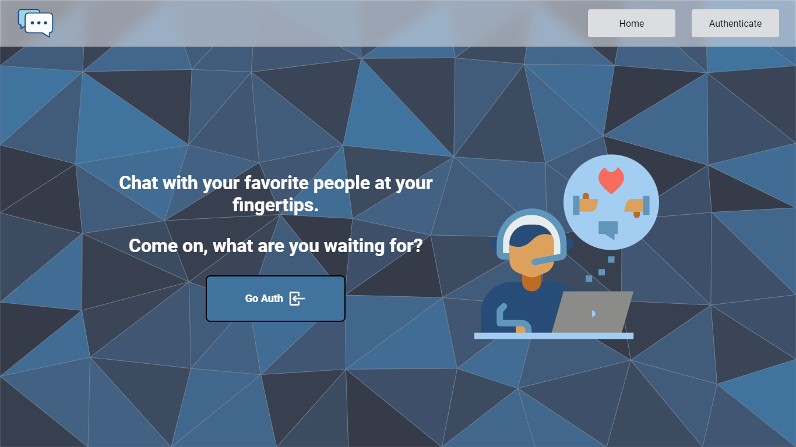
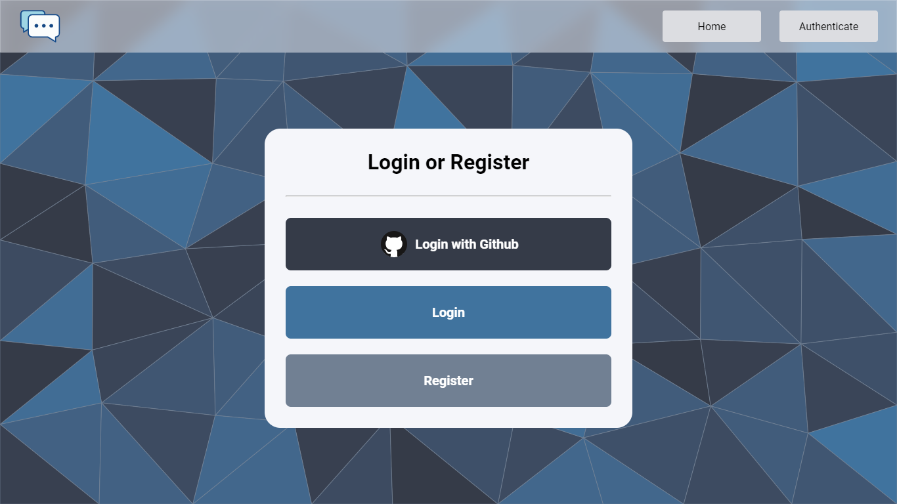
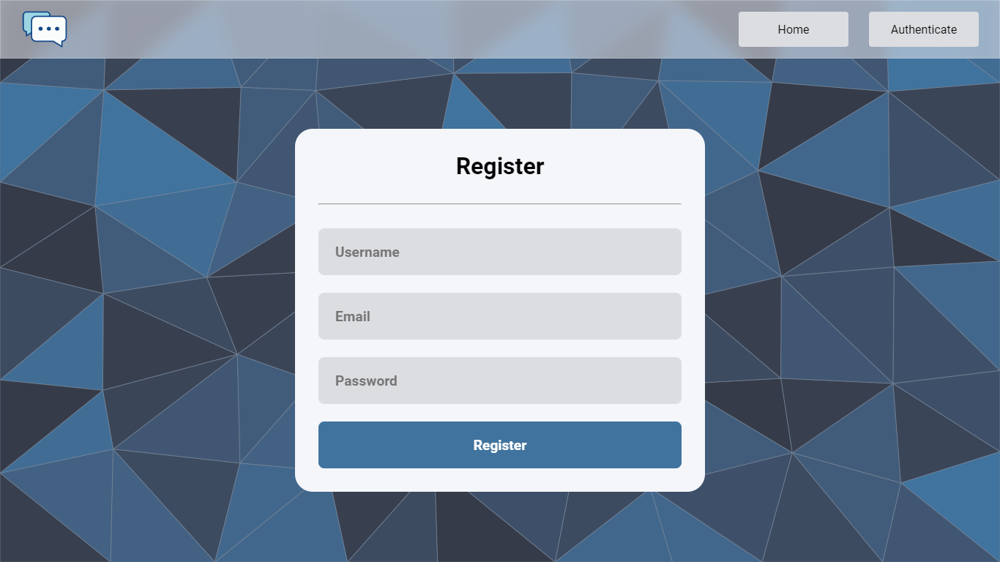
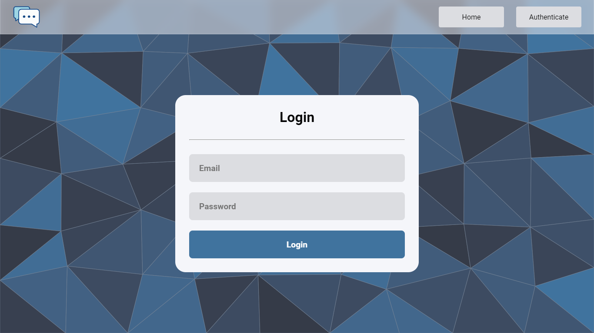
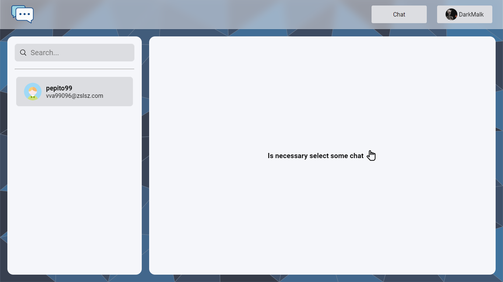
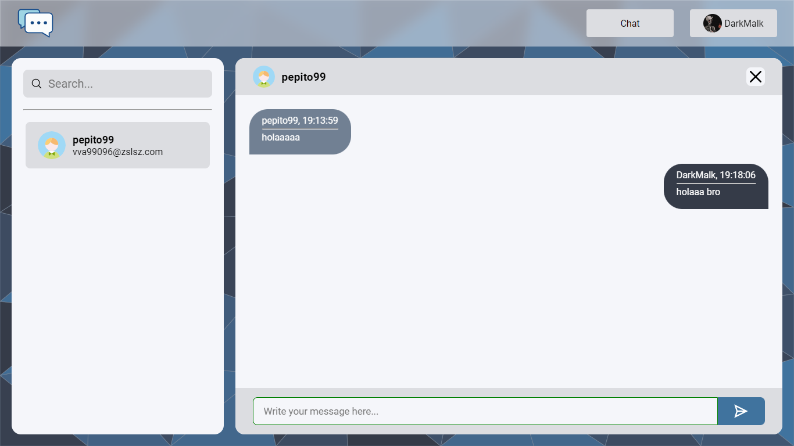

# Version Mobile

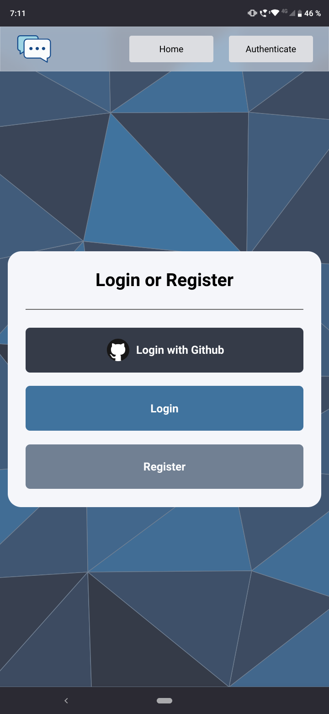
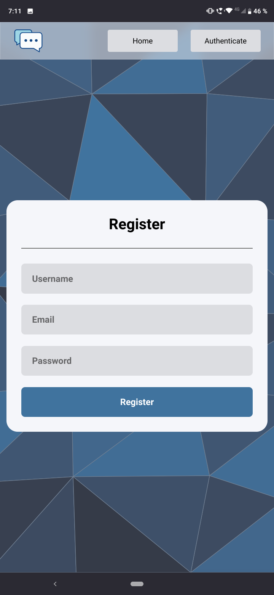
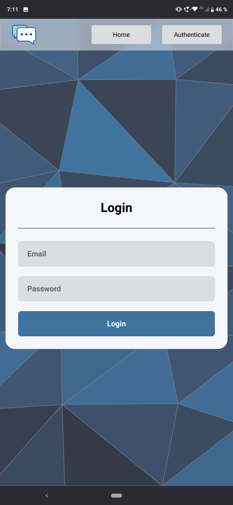
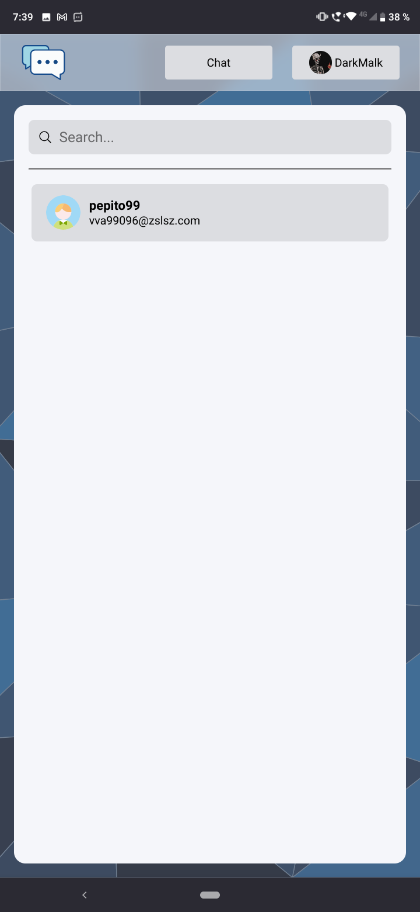
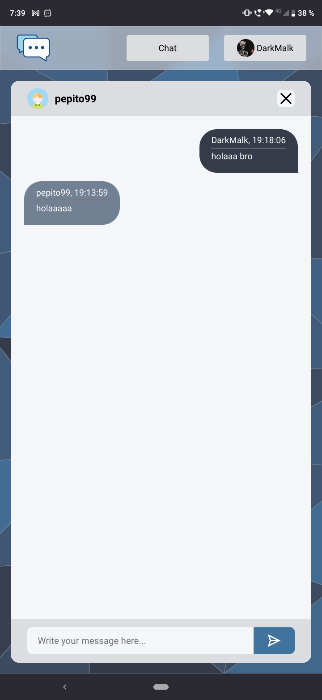
